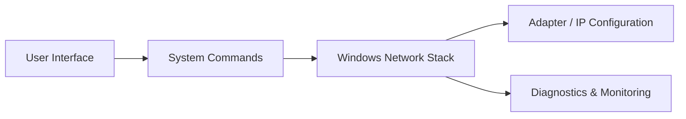

<h1 align="center">🌐 Network Command Center v2.0 ⚡</h1>

  

  
  
  
  
  

---

## 🧠 Overview

**Network Command Center v2.0** is a powerful GUI-based network management and diagnostic toolkit designed for **ground station environments, system engineers, and advanced users**.

It replaces complex command-line networking tasks with a **modern, intuitive interface**, allowing you to configure IP settings, monitor adapters, troubleshoot connectivity, and analyze network behavior efficiently. :contentReference[oaicite:0]{index=0}

---

## ✨ Features

🚀 **Network Configuration**

* 🌐 Set Static IP (IPv4)
* 🔄 Switch between Static & DHCP
* ⚠️ Detect IP conflicts automatically

📡 **Diagnostics & Monitoring**

* 📶 Advanced Ping Tool with live output
* 🧠 Smart network issue diagnosis
* 🔍 Port & connection analysis

🖥️ **Adapter Control**

* 🔌 Enable / Disable network adapters
* 📊 View adapter status, IP, MAC
* ⚡ Real-time refresh & monitoring

💡 **User Experience**

* 🎨 Modern dark-themed UI
* 📋 Copy-to-clipboard everywhere
* 🔔 Toast notifications & smart dialogs
* ⚡ Multi-threaded operations (no UI freeze)

---

## ⚙️ Requirements

### 💻 System

* Windows OS (Recommended)
* Administrator Privileges (Required for full features)

### 🐍 Software

* Python 3.12+

### 📦 Libraries

* tkinter (built-in)
* standard Python libraries (subprocess, socket, threading, etc.)

  

---

## ⚙️ How It Works

---

## 🎯 Use Case

Designed for environments where **network reliability and control are critical**:

* 🛰️ Ground stations & telemetry systems  
* 🏢 Enterprise network management  
* 🔐 Secure / restricted environments (DRDO-type setups)  
* 🧪 Testing & troubleshooting labs  

---

## 👨‍💻 Author

  <b>Chiranjib Kar</b> 

---

## 🔄 Workflow

### 🖥️ Configuration

* Select adapter → View current config → Apply Static IP / DHCP  

### 📡 Diagnostics

* Ping target → Analyze response → Identify issues  

### 🔌 Adapter Management

* Enable / Disable → Monitor → Refresh state  

---

## 📜 License & Usage

This project is licensed under **CBtronix Labs Source License v2.0 (CBLSL v2.0)**.

### ✅ You are allowed to:

* Use the software for personal or commercial purposes  
* Run and distribute the software in its original form
* Modify or alter the source code  

### ❌ You are NOT allowed to:
 
* Redistribute modified versions  
* Rebrand or sell this software as your own  

### ⚠️ Note:

This is **not fully open-source**. The source is shared with restrictions.

See [LICENSE](./LICENSE) for full terms.
